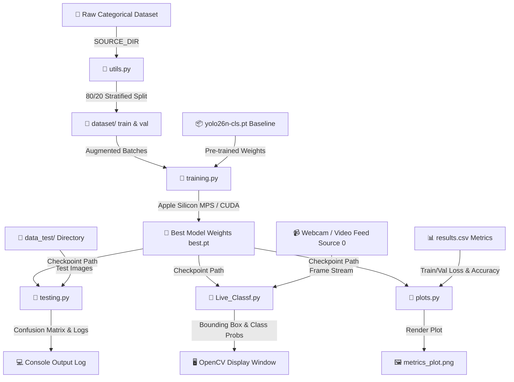

# 🚀 Recycling & Waste Sorting Computer Vision (YOLO Classification)

Welcome to the **Recycling & Waste Sorting Computer Vision** repository! This project leverages state-of-the-art Deep Learning with **YOLOv8 classification networks** to dynamically identify, classify, and sort recyclable waste materials (such as glass, paper, cardboard, plastic, metal, and trash) in real time.

---

## 🏗️ Architecture & Flow Scheme

The pipeline covers dataset preparation, hardware-accelerated model training, automated test set evaluation, metrics visualization, and live video stream classification.



---

## 📂 Directory Structure

```
Recycling_Sorting_CV/
├── 📄 Live_Classf.py
├── 📄 metrics_plot.png
├── 📄 plots.py
├── 📄 README.md
├── 📄 requirements.txt
├── 📄 testing.py
├── 📄 training.py
├── 📄 utils.py
├── 📄 yolo26n-cls.pt
├── 📂 dataset/
│   ├── 📂 train/
│   └── 📂 val/
├── 📂 data_test/
└── 📂 runs/
    └── 📂 classify/
        └── 📂 train-3/
            └── 📂 weights/
                └── 📄 best.pt
```

---

## 📄 File Details

| File / Path | Description & Role |
| --- | --- |
| [utils.py](file:///Users/wess/Desktop/computer%20vision/Recycling_Sorting_CV%E2%99%BB%EF%B8%8F%20%20/utils.py) | Data pre-processing utility that uses `splitfolders` to perform deterministic 80/20 train/validation splits from raw source datasets. |
| [training.py](file:///Users/wess/Desktop/computer%20vision/Recycling_Sorting_CV%E2%99%BB%EF%B8%8F%20%20/training.py) | Main training pipeline for fine-tuning YOLOv8 classification models (`yolo26n-cls.pt`) utilizing MPS (Metal Performance Shaders) acceleration and RAM caching. |
| [testing.py](file:///Users/wess/Desktop/computer%20vision/Recycling_Sorting_CV%E2%99%BB%EF%B8%8F%20%20/testing.py) | Batch evaluation script that parses test images across `data_test/`, computes overall top-1 accuracy, and generates detailed misclassification logs. |
| [Live_Classf.py](file:///Users/wess/Desktop/computer%20vision/Recycling_Sorting_CV%E2%99%BB%EF%B8%8F%20%20/Live_Classf.py) | Real-time classification engine running live inference on webcam stream (`source=0`) with interactive OpenCV visualization. |
| [plots.py](file:///Users/wess/Desktop/computer%20vision/Recycling_Sorting_CV%E2%99%BB%EF%B8%8F%20%20/plots.py) | Visualization utility that extracts epoch metrics from Ultralytics `results.csv` and renders high-resolution plots for training/val loss and top-1/top-5 accuracies. |
| [requirements.txt](file:///Users/wess/Desktop/computer%20vision/Recycling_Sorting_CV%E2%99%BB%EF%B8%8F%20%20/requirements.txt) | Specification of Python package dependencies including `ultralytics`, `opencv-python`, `split-folders`, `matplotlib`, and `pandas`. |

---

## 🧮 How It Works (Core Logic)

### 1. Stratified Dataset Generation (`utils.py`)
`utils.py` handles reproducible train/validation splitting using a fixed random seed (`seed=42`). It maintains relative category ratios without mutating original source data files:

$$\text{Ratio} = 0.80 \text{ (Train)}, \quad 0.20 \text{ (Validation)}$$

### 2. Apple Silicon Accelerated Training (`training.py`)
The model is trained using Ultralytics YOLO classification architecture. Optimization is configured specifically to leverage Apple's Metal Performance Shaders (`device="mps"`), caching data in memory (`cache=True`) and loading images with 8 parallel worker processes (`workers=8`):

```python
model = YOLO("yolo26n-cls.pt")
model.train(
    data="dataset",
    epochs=25,
    imgsz=256,
    batch=64,
    device="mps",
    workers=8,
    cache=True,
)
```

### 3. Misclassification Audit & Top-1 Accuracy Computation (`testing.py`)
During batch verification, `testing.py` scans each image across ground-truth directory names. It compares the argmax class ID (`top1_id`) converted to its human-readable string name (`top1_name`) against the ground-truth directory `dir`. Incorrect predictions append structured records to `error_details`:

```python
results = model.predict(source=file, verbose=False)
for res in results:
    top1_id = res.probs.top1
    top1_name = res.names[top1_id]
    top1_conf = res.probs.top1conf.item() * 100

    if top1_name != dir:
        error += 1
        error_details.append({
            "file_path": str(file),
            "true_class": dir,
            "predicted_class": top1_name,
            "confidence": top1_conf,
        })
```

---

## 🛠️ Setup & Requirements

### Requirements
- Python 3.8+
- PyTorch (with MPS support for macOS or CUDA for Linux/Windows)
- OpenCV
- Ultralytics YOLO

### 1. Virtual Environment Setup

```bash
# Create virtual environment
python3 -m venv .venv

# Activate virtual environment
# On macOS / Linux:
source .venv/bin/activate
# On Windows:
# .venv\Scripts\activate
```

### 2. Dependency Installation

```bash
pip install -r requirements.txt
```

> 💡 **macOS Note**: If you encounter issues with Pillow during OpenCV image rendering or PyTorch transformations, reinstall Pillow:
> ```bash
> pip install --upgrade --force-reinstall pillow
> ```

---

## 🎮 Controls / Usage

### 📊 1. Prepare Dataset
Split your raw data located in `data/train-val/standardized_256` into `dataset/`:
```bash
python utils.py
```

### 🏋️ 2. Train Model
Run the model training pipeline:
```bash
python training.py
```

### 🧪 3. Evaluate & Benchmark
Run evaluation across test images to output summary accuracy and misclassification logs:
```bash
python testing.py
```

### 📈 4. Plot Loss & Accuracy Curves
Generate and display visual performance metrics:
```bash
python plots.py
```

### 📹 5. Real-Time Live Webcam Inference
Launch webcam stream classification:
```bash
python Live_Classf.py
```
> **Controls in OpenCV Window**: Press `q` or `Esc` to quit the live feed.
