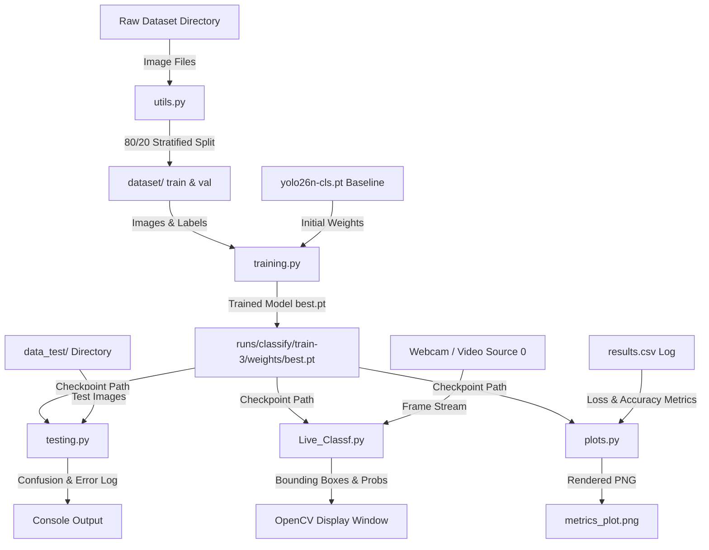

# Overview

An automated computer vision system for real-time waste classification and sorting using YOLOv8 classification models. It ingests raw image streams or video feeds to categorize items into distinct recycling classes, outputting classification probabilities and inference logs for evaluation.

# Architecture



# Project Layout

```
.
├── Live_Classf.py
├── metrics_plot.png
├── plots.py
├── requirements.txt
├── testing.py
├── training.py
├── utils.py
├── dataset/
├── data_test/
└── runs/
```

| Path | Responsibility |
| --- | --- |
| `utils.py` | Splits raw images from `SOURCE_DIR` into an 80/20 train/val structure using `splitfolders`. |
| `training.py` | Trains the YOLOv8 classification model using Metal Performance Shaders (`mps`) hardware acceleration. |
| `testing.py` | Iterates over directory structures in `data_test/` to evaluate model accuracy and log misclassifications. |
| `Live_Classf.py` | Runs real-time inference on a webcam feed (`source=0`) and renders output predictions. |
| `plots.py` | Parses training run output (`results.csv`) to plot loss curves and validation accuracies. |
| `requirements.txt` | Defines external Python library dependencies required to execute the scripts. |

# Core Logic

The pipeline relies on Ultralytics YOLO classification models (`yolo26n-cls.pt`). Data pre-processing isolates categorical subdirectories and establishes deterministic splits prior to training.

During evaluation, `testing.py` performs recursive directory verification across `data_test/`. It extracts the top-1 predicted class index (`top1_id`) and maps it back to the class label dictionary (`res.names`). An accuracy counter increments when the predicted label differs from the immediate parent directory name:

```python
results = model.predict(source=file, verbose=False)
for res in results:
    top1_id = res.probs.top1
    top1_name = res.names[top1_id]
    top1_conf = res.probs.top1conf.item() * 100
    if top1_name != dir:
        error += 1
```

Training runs are configured to leverage Apple Silicon hardware acceleration via PyTorch's Metal Performance Shaders backend (`device="mps"`). Datasets are cached in memory (`cache=True`) across 8 parallel CPU worker threads (`workers=8`) to eliminate disk I/O bottlenecks during epoch iterations.

# Setup

### Installation

Clone the repository and install dependencies within a Python environment:

```bash
git clone https://github.com/Wissem-Sahli-Engineer/Recycling_Sorting_Computer_Vision_CNN--.git
cd Recycling_Sorting_Computer_Vision_CNN--
pip install -r requirements.txt
```

### Environment Variables

| Name | Default | Description |
| --- | --- | --- |
| `SOURCE_DIR` | `data/train-val/standardized_256` | Source directory containing raw categorical images before splitting. |
| `OUTPUT_DIR` | `dataset` | Target output directory for 80/20 stratified `train` and `val` subdirectories. |
| `TEST_DATA` | `data_test/Garbage classification` | Directory containing ground-truth categorized images for validation runs. |

### Pitfalls

- **Pillow Version Mismatch**: On macOS, existing Pillow installations may conflict with OpenCV window rendering or PyTorch transformations. Reinstall Pillow if image loading fails:
  ```bash
  pip install --upgrade --force-reinstall pillow
  ```
- **Webcam Access Permissions**: `Live_Classf.py` defaults to `source=0`. If running on macOS, ensure the terminal application has explicit camera access permissions granted under System Settings.

# Usage

### Dataset Preparation

Split raw images into train and validation sets:

```bash
python utils.py
```

Expected output:
```
[SUCCESS] Created train/ and val/ datasets under 'dataset'
```

### Model Training

Train the classification network:

```bash
python training.py
```

### Evaluation

Evaluate the model against test data:

```bash
python testing.py
```

Expected output snippet:
```
12 errors of 200 images in glass
34 errors of 1200 images
Accuracy = 97.17

============================================================
MISCLASSIFIED IMAGES LOG
============================================================
File: data_test/Garbage classification/glass/glass12.jpg | True: glass | Pred: metal (84.32%)
```

### Plotting Performance Metrics

Generate loss and accuracy charts:

```bash
python plots.py
```

Expected output:
```
[SUCCESS] Plot saved to './metrics_plot.png'
```

### Live Stream Inference

Run inference on camera feed:

```bash
python Live_Classf.py
```